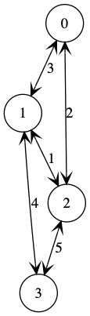

# paths
Find solution to a graph traversal problem.

## The Problem

The goal is to find the path from a start node to an end node where edges between nodes have a cost associated with them.  The best path is that which minimizes the maximum cost of the highest cost edge along the path.

The input format for specifying the graph nodes, edges, and the costs of edges is described here.

Each line in the input represents a record with three integer values:

| field | description |
|-------|-------------|
| 1 | node index |
| 2 | node index |
| 3 | edge cost |

In this way, the edges in the graph are defined by pairs of node indices that are connected.

An example is as follows:

```
0 1 3
0 2 2
1 2 1
1 3 4
2 3 5
```

In the above example, the cost of traversing from node `0` to node `1` is `3`, traversing from node `0` to node `2` is `2`, `1` to `2` is `1`, and so on.  While the input here is sorted by the record values, this is not necessary.  As long as a valid graph is serialized (i.e., there is a path from the start node to the end node), then the program will still find the optimal solution.

The bidirectional graph, when visualized with edges labeled with their costs, looks like this:



## Usage
To run the program, provide it with a text file with a graph description as previously described, and optionally target start and end nodes.  If a start node is not specified, the start node is assumed to be the node in the graph with the minimum index.  Similarly, if an end node is not specified, the end node is assumed to be the node in the graph with the maximum index.

```
$ ./paths.py -h
usage: paths.py [-h] [-s START] [-e END] [-v] input

Find solutions to a graph traversal problem. The goal is to find the path from
a start node to an end node where edges between nodes have a cost associated
with them. The best path is that which minimizes the maximum cost of the
highest cost edge along the path.

positional arguments:
  input                 input data file (use "-" to read from stdin)

optional arguments:
  -h, --help            show this help message and exit
  -s START, --start START
                        start node in the graph (default: None)
  -e END, --end END     end node in the graph (default: None)
$ cat data.txt 
0 1 3
0 2 2
1 2 1
1 3 4
2 3 5
$ ./paths.py data.txt
cost	path
4	(0, 1, 3)
4	(0, 2, 1, 3)
5	(0, 2, 3)
5	(0, 1, 2, 3)
$ ./paths.py data.txt -s 1
cost	path
4	(1, 3)
5	(1, 2, 3)
5	(1, 0, 2, 3)
$ ./paths.py data.txt -s 1 -e 0
cost	path
2	(1, 2, 0)
3	(1, 0)
5	(1, 3, 2, 0)
```
